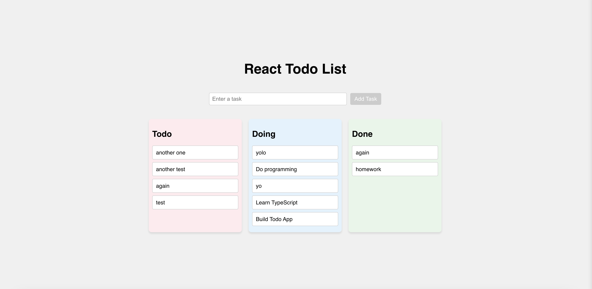

# Todo List App

This is a frontend-only todo list app featuring a drag-and-drop interface and persistent local storage. The app includes three columns, (**Todo**, **Doing**, and **Done**) and allows users to add, move, and reorder tasks with ease. When a task is moved into the **Done** column, a **confetti explosion** celebrates your accomplishment.

---

## Screenshot

---

## Getting Started

### 1. Clone the repository

### 2. Install dependencies

- `npm install`

### 3. Run the development server

- `npm start`

Then open `localhost:3000` in your browser.

---

# Built With

- React
- TypeScript
- [Hello Pangea Dnd](https://github.com/hello-pangea/dnd)
- [React Confetti](https://www.npmjs.com/package/react-confetti)